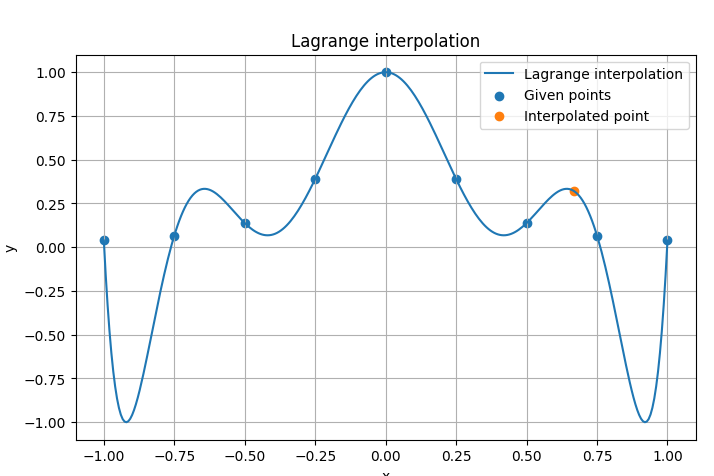
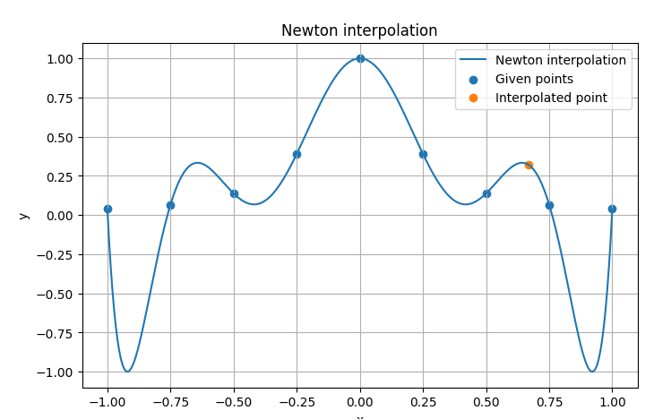
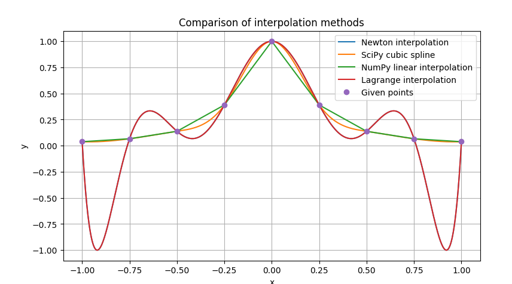
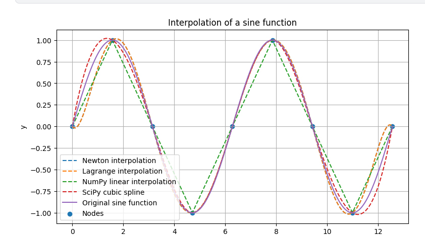
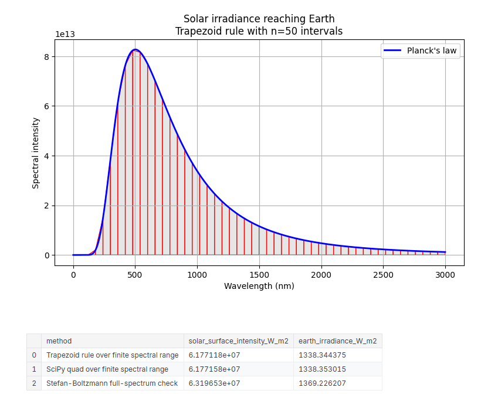
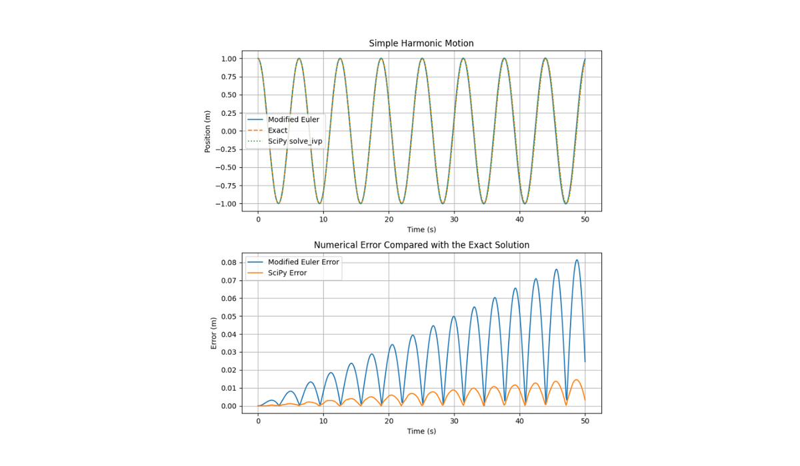
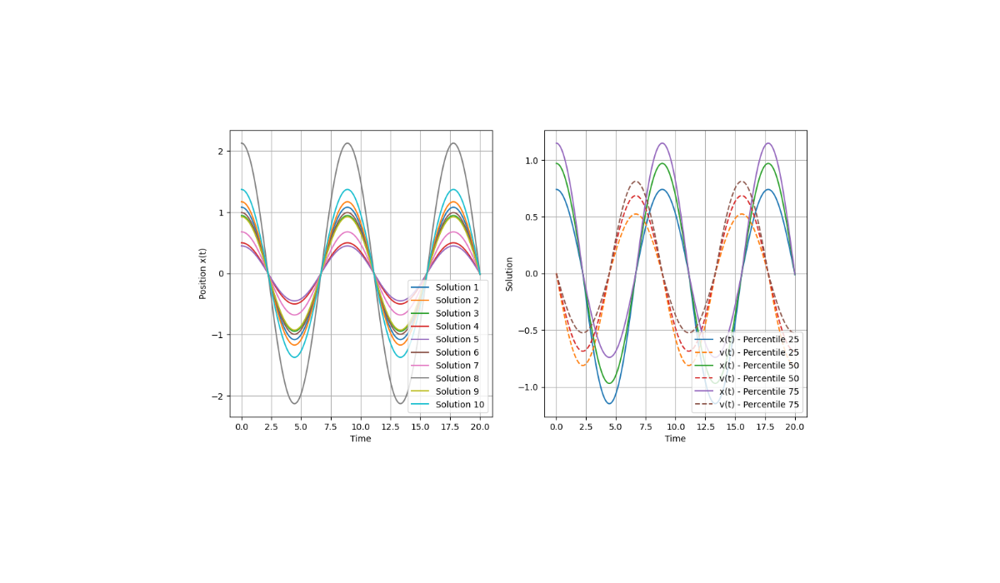

# Computational Physics Numerical Methods

Scientific Python notebooks implementing classical numerical methods and computational physics simulations.

This repository contains a collection of cleaned and documented notebooks based on undergraduate Physics coursework. The notebooks cover polynomial interpolation, numerical integration, ordinary differential equation solvers and stochastic simulation.

The goal of this project is to demonstrate a clear scientific-computing workflow using Python, NumPy, SciPy and Matplotlib.

## Live Demo

A combined Kaggle version of the project is available here:

[Computational Physics: Numerical Methods in Python](https://www.kaggle.com/code/albertoreyescastro20/computational-physics-numerical-methods-in-python)

The Kaggle notebook groups the four practices into a single executable showcase.

## Project Overview

The repository is organised into four main notebooks:

```text
notebooks/
├── 01_interpolation_lagrange_newton.ipynb
├── 02_numerical_integration_trapezoid_simpson_planck.ipynb
├── 03_ode_solvers.ipynb
└── 04_stochastic_harmonic_oscillator.ipynb
```

## Preview

### Polynomial Interpolation









### Numerical Integration and Planck's Law



### ODE Solvers



### Stochastic Harmonic Oscillator



## Notebooks

### 01 — Polynomial Interpolation

This notebook implements and compares different interpolation techniques.

Main topics:

- Lagrange interpolation
- Newton interpolation using divided differences
- Polynomial interpolation uniqueness
- Comparison with NumPy interpolation
- Comparison with SciPy cubic splines
- Runge-type behaviour in high-degree polynomial interpolation

The notebook shows that Lagrange and Newton interpolation are two different algebraic forms of the same unique interpolating polynomial when the same nodes are used.

### 02 — Numerical Integration and Planck's Law

This notebook implements numerical integration methods and applies them to both mathematical and physical examples.

Main topics:

- Composite trapezoid rule
- Composite Simpson 1/3 rule
- Absolute and relative error
- Error bounds
- Convergence behaviour with different numbers of subintervals
- Numerical integration of Planck's law
- Comparison with SciPy `quad`
- Stefan-Boltzmann consistency check

The Planck-law example estimates solar irradiance reaching Earth using numerical integration over a finite wavelength range.

### 03 — ODE Solvers

This notebook studies numerical methods for solving ordinary differential equations.

Main topics:

- Euler method
- Modified Euler method
- Predictor-corrector methods
- SciPy `solve_ivp`
- Comparison of numerical solutions
- Physical ODE examples

The notebook highlights the behaviour and accuracy of different numerical schemes for initial-value problems.

### 04 — Stochastic Harmonic Oscillator

This notebook studies a simple harmonic oscillator with stochastic variation in the initial position.

Main topics:

- Second-order differential equations
- Conversion to a first-order system
- SciPy `solve_ivp`
- Stochastic initial conditions
- Normal-distribution sampling
- Percentile analysis
- Visualisation of stochastic trajectories

The notebook preserves the original coursework structure while presenting the analysis in a clean public format.

## Technologies Used

- Python
- NumPy
- SciPy
- Matplotlib
- Pandas
- SymPy
- Jupyter Notebook

## Repository Structure

```text
computational-physics-numerical-methods/
│
├── README.md
├── requirements.txt
├── .gitignore
├── LICENSE
│
├── figures/
│   ├── 01_lagrange_interpolation.png
│   ├── 01_newton_interpolation.png
│   ├── 01_interpolation_comparison.png
│   ├── 01_sine_interpolation.png
│   ├── 02_planck_solar_irradiance.png
│   ├── 03_ode_solvers_comparison.png
│   └── 04_stochastic_harmonic_oscillator.png
│
└── notebooks/
    ├── 01_interpolation_lagrange_newton.ipynb
    ├── 02_numerical_integration_trapezoid_simpson_planck.ipynb
    ├── 03_ode_solvers.ipynb
    └── 04_stochastic_harmonic_oscillator.ipynb
```

## Installation

Clone the repository:

```bash
git clone https://github.com/albertoreyescastro/computational-physics-numerical-methods.git
cd computational-physics-numerical-methods
```

Install the required packages:

```bash
pip install -r requirements.txt
```

Launch Jupyter Notebook:

```bash
jupyter notebook
```

## Motivation

This project reflects my background in Physics and my interest in scientific computing, numerical methods and applied Python programming.

It also complements my current work in Artificial Intelligence by showing the mathematical and computational foundations behind modelling, simulation and algorithmic problem solving.

## Author

**Alberto Reyes Castro**  
Physics graduate and MSc Artificial Intelligence student.

## License

This project is licensed under the MIT License.
